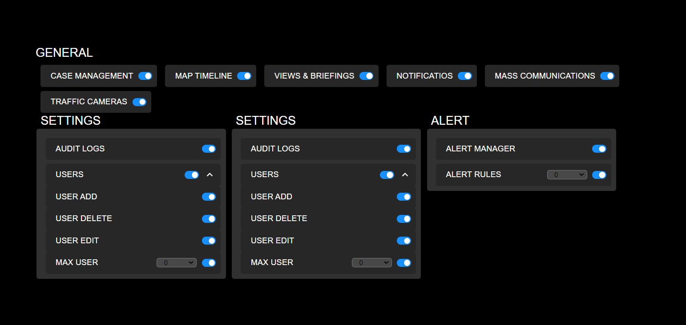

# Feature Flag UI

This project implements a React component for managing feature flags and account limits. The UI is based on a provided screenshot and follows specific behavioral rules.

### Note: This React project serves as a demonstration of my frontend skills, utilizing React, TypeScript, and fundamental component testing. While it may not include advanced features, it showcases my proficiency in building functional and well-structured applications.

## Features

- Dynamic toggle management for features and account limits
- Support for grouped and individual toggles
- Additional inputs (e.g., numeric dropdowns) for certain toggles
- Parent-child relationship support for nested features
- Responsive behavior based on parent toggle state

## Technical Details

- Built with React and TypeScript
- Uses a dynamic schema to drive the form structure
- Designed to run on ReactDOM.render() for demo purposes
- Utilizes the "Industry" font for UI consistency (optional)

## UI Rules

1. Toggles can be grouped or standalone
2. Some toggles may have additional inputs (e.g., numeric dropdowns)
3. Features can have parent-child relationships (e.g., users > users add)
4. When a parent toggle is enabled:
   - Child toggles are expanded and displayed
   - Child toggles can be individually toggled on/off
5. When a parent toggle is disabled:
   - Child toggles are disabled and collapsed

 
## Getting Started

1. Clone the repository
2. Install dependencies: `npm install`
3. Start the development server: `npm start`
4. To run the basic test case: `npm test`
